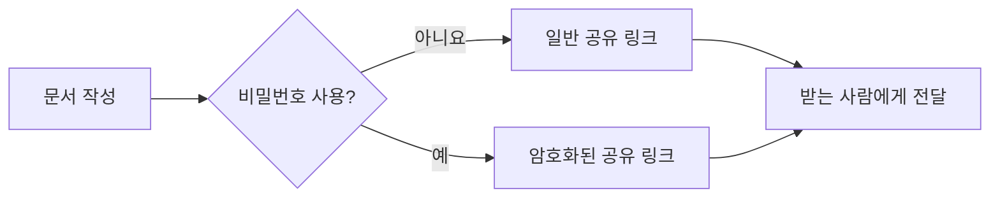
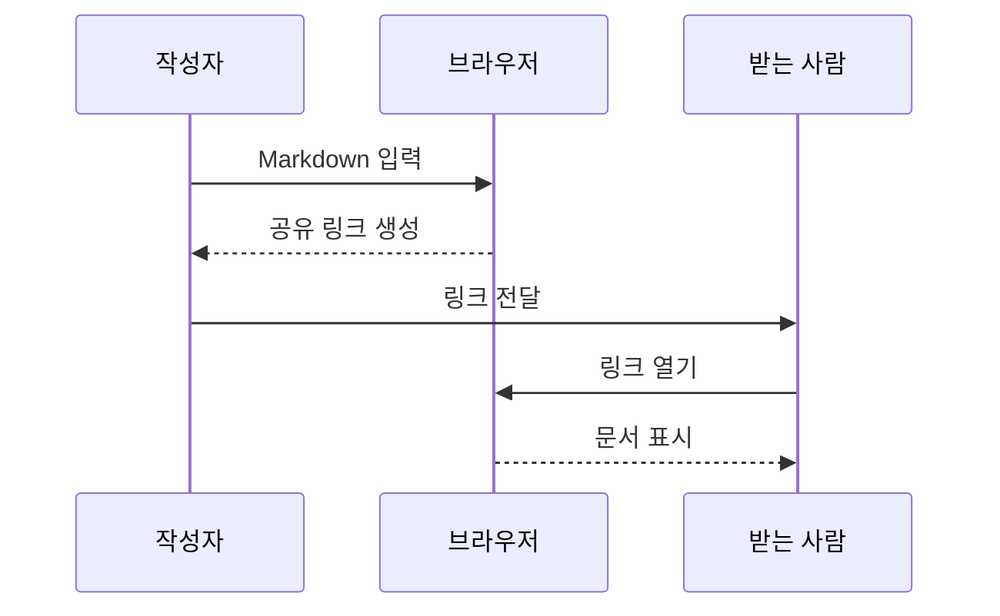
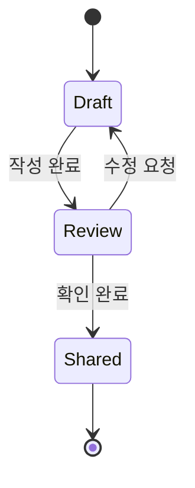
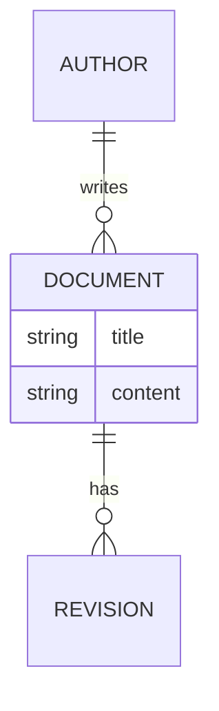
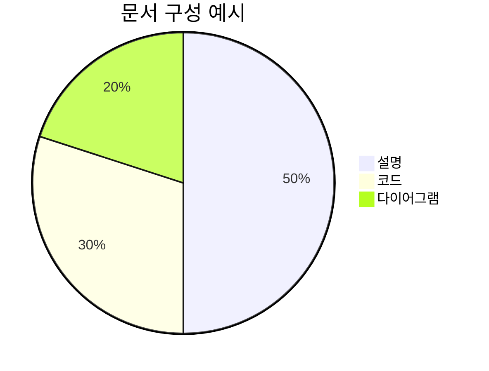
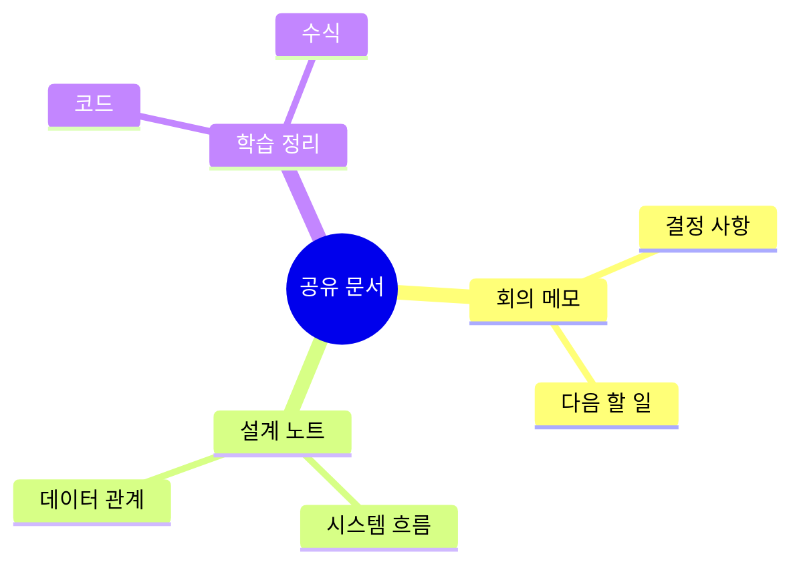

# 문서 안에서 그리는 다이어그램

`mermaid` 코드 블록으로 흐름과 관계를 설명합니다. 아래 예시는 모두 같은 문서 안에서 렌더링됩니다.

## 문서 공유 흐름

```mermaid
flowchart LR
  A[문서 작성] --> B{비밀번호 사용?}
  B -->|아니요| C[일반 공유 링크]
  B -->|예| D[암호화된 공유 링크]
  C --> E[받는 사람에게 전달]
  D --> E
```

## 시퀀스 다이어그램

```mermaid
sequenceDiagram
  participant A as 작성자
  participant B as 브라우저
  participant R as 받는 사람
  A->>B: Markdown 입력
  B-->>A: 공유 링크 생성
  A->>R: 링크 전달
  R->>B: 링크 열기
  B-->>R: 문서 표시
```

## 상태 다이어그램

```mermaid
stateDiagram-v2
  [*] --> Draft
  Draft --> Review: 작성 완료
  Review --> Draft: 수정 요청
  Review --> Shared: 확인 완료
  Shared --> [*]
```

## 데이터 관계

```mermaid
erDiagram
  AUTHOR ||--o{ DOCUMENT : writes
  DOCUMENT ||--o{ REVISION : has
  DOCUMENT {
    string title
    string content
  }
```

## 구성 비율

```mermaid
pie title 문서 구성 예시
  "설명" : 50
  "코드" : 30
  "다이어그램" : 20
```

## 마인드맵

```mermaid
mindmap
  root((공유 문서))
    회의 메모
      결정 사항
      다음 할 일
    설계 노트
      시스템 흐름
      데이터 관계
    학습 정리
      코드
      수식
```
